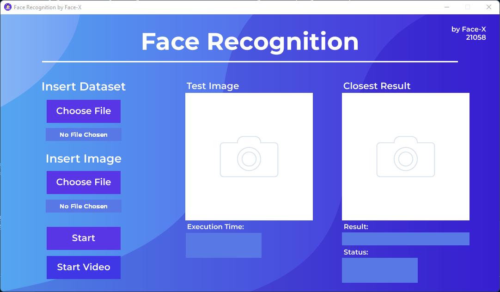
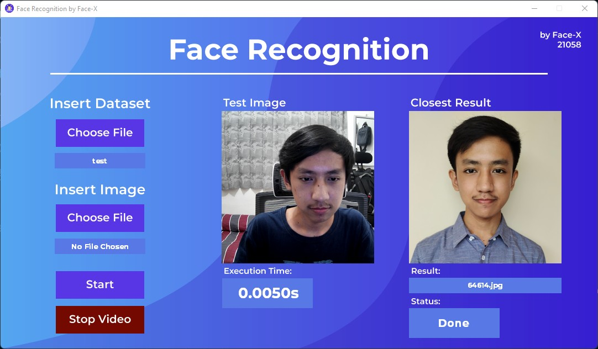

# Face Recognition with Eigenface
> Tugas Besar 2 IF 2123 Aljabar Linier dan Geometri Aplikasi Nilai Eigen dan EigenFace pada Pengenalan Wajah (Face Recognition) Semester I Tahun 2022/2023


## Table of Contents
* [General Info](#general-information)
* [Technologies Used](#technologies-used)
* [Features](#features)
* [Screenshots](#screenshots)
* [Setup](#setup)
* [Usage](#usage)
* [Project Status](#project-status)
* [Room for Improvement](#room-for-improvement)
* [To Do](#to-do)


## General Information
- The goal of this project is to implement a web or GUI that can recognize someone's face by comparing it with similar images inside the program database/dataset. 
- The eigenface were calculated without any help from libraries that could calculate eigenvalues/ eigenvectors directly. 
- Students were asked to implement what they got in class by making their own code to calculate eigenvaluses, and eigenvectors.


## Technologies Used
- Python 3.11.0
- numpy 1.23.4
- OpenCV 4.6.0
- Pillow 9.3.0
- Tkinter 8.6


## Features
List the ready features here:
- Face recognition from image
- Face recognition using camera


## Screenshots




## Setup
Prerequirement:
1. Python:https://www.python.org/downloads/
2. Pip:https://pip.pypa.io/en/stable/installation/

In terminal:
  ``` powerShell
  pip install numpy
  pip install opencv-python
  pip install tk
  pip install Pillow
  ```


## Usage
Method 1:
  1. Make sure the directory on the terminal is in '.\Algeo02-21058\'
  2. Run main.py inside src folder using vscode extension

Method 2:
  1. Make sure the directory on the terminal is in '.\Algeo02-21058\'
  2. py src/main.py


## Project Status
Project is: <span style = "color : yellow" >_no longer being worked on_ </span>


## Room for Improvement
Room for improvement:
- Long loading time while updating database


## To Do
To do:
- [x] function scanning image to matrix
- [x] function calculate mean of all matrix
- [x] function calculate difference between training image and mean
- [x] function calculate value of covarian matrix
- [x] function calculate eigen value and eigen vector
- [x] function calculate value of Eigenface
- [x] function calculate new face image
- [x] Identification function
- [x] GUI
- [x] Implement the program to GUI